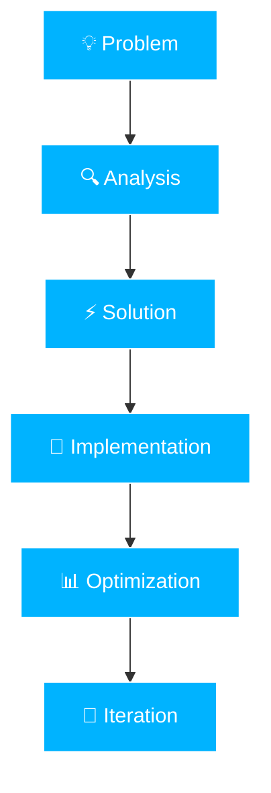

<div align="center">
  
</div>

<div align="center">
  
  ### 🚀 Full Stack Developer | 🇧🇷 Ceará, Brazil
  
  [](mailto:mardonedias@gmail.com)
  

</div>

<br>


### 👨‍💻 About Me

```typescript
const mardone = {
    location: "Ceará 🌴, Brazil",
    role: "Full Stack Developer",
    code: ["JavaScript", "TypeScript", "Python", "Dart"],
    askMeAbout: ["web dev", "mobile", "cloud", "design"],
    technologies: {
        frontend: ["Vue.js", "Quasar", "Vite"],
        backend: ["Node.js", "Express", "NestJS"],
        mobile: ["Flutter"],
        databases: ["MongoDB", "Redis", "CouchDB", "SQLite"],
        devOps: ["Docker", "AWS", "GCP", "GitHub Actions"],
        tools: ["Git", "VS Code", "Swagger"]
    },
    architecture: ["Microservices", "Event-Driven", "REST APIs"],
    currentFocus: "Building scalable solutions",
    funFact: "Programming is my hobby! 🎮"
};
```

<br clear="right"/>

---

<h2 align="center">🛠️ Tech Stack</h2>

<div align="center">

### Core Technologies


### Frontend & Mobile


### Backend & Database


### Cloud & DevOps


</div>

---

<h2 align="center">📊 GitHub Analytics</h2>

<div align="center">
   
  
</div>

<div align="center">
  
</div>

---

<h2 align="center">🎯 What I Do</h2>

<div align="center">

| 🌐 **Full Stack Development** | 📱 **Mobile Apps** | ☁️ **Cloud Solutions** |
|:---:|:---:|:---:|
| Modern web applications with Vue.js and Node.js | Cross-platform apps with Flutter | Scalable infrastructure on AWS/GCP |

| 🎨 **UI/UX Design** | 🔧 **DevOps & Automation** | 📈 **Performance Optimization** |
|:---:|:---:|:---:|
| Beautiful, functional interfaces | CI/CD pipelines and containerization | Fast, efficient, maintainable code |

</div>

---

<h2 align="center">💭 Philosophy</h2>

<div align="center">



**Clean Code • Smart Decisions • Continuous Learning • User-Focused**

</div>

---

<h2 align="center">🤝 Let's Connect</h2>

<div align="center">
  
[](mailto:mardonedias@gmail.com)
[](https://github.com/mardonedias)

<br>

> *"The best programs are written when the programmer is supposed to be working on something else."* – Melinda Varian

</div>


